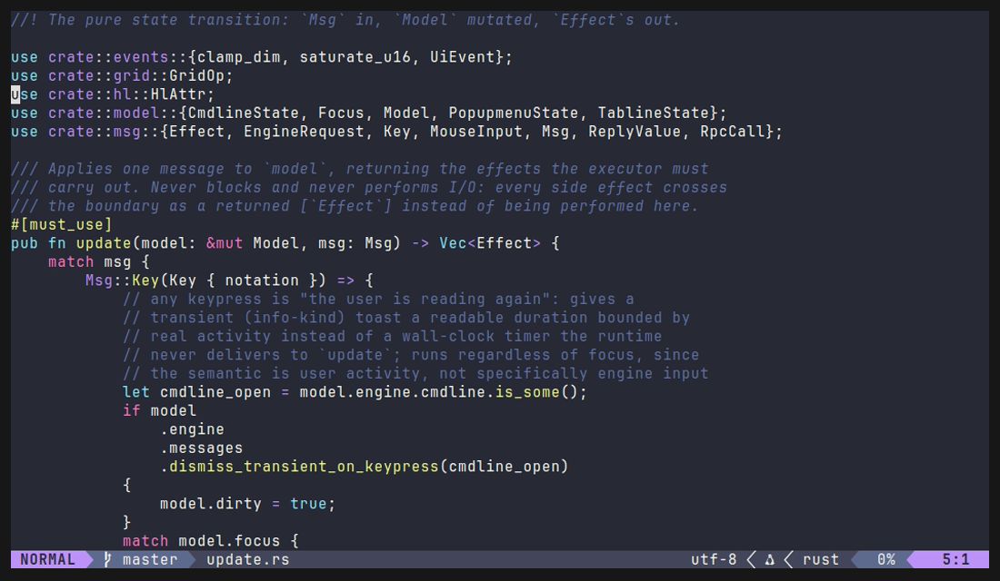

<div align="center">


# view

An agent-native, Rust-fast terminal editor with a modern UI, where your Neovim config just works.

[](https://github.com/tj-smith47/view/actions/workflows/ci.yml)
[](#license)
[](#roadmap)

[Features](#features) &bull;
[Not a distro](#not-another-neovim-distro) &bull;
[Performance](#performance) &bull;
[Roadmap](#roadmap) &bull;
[Building](#building-from-source)



</div>

> [!WARNING]
> view is pre-alpha and not usable as a daily editor yet. The engine, the
> runtime, and the test infrastructure are built; most of the visible feature
> set is still landing. See the [roadmap](#roadmap).

## What is view?

view is a terminal editor with a real Neovim inside. Your `init.lua`,
plugins, LSP servers, and treesitter setup work on day one, because the same
Neovim you already run is running them. Around that engine, view draws its
own UI in native Rust: one design system for the editor chrome instead of a
patchwork of plugins, a process that paints before your config has finished
loading, and (coming in a later phase) AI agents as a first-class part of
the editor rather than a bolt-on.

## Features

- **Bring your whole config.** Real Neovim is the engine, so compatibility
  comes from running your setup, not reimplementing it. A differential
  oracle checks view against a reference Neovim on every build, and a compat
  suite drives pinned real-world plugin stacks (telescope, lualine, noice,
  nvim-cmp, treesitter, mini.nvim, and more) through a real pty.
- **Fast where you feel it.** view paints a usable shell in ~4 ms and first
  content 1.7 to 5x sooner than bare Neovim, at 3.4 MB resident. Every claim
  is measured, paired, and regression-gated in CI. See
  [Performance](#performance).
- **Modern out of the box.** The surfaces view owns (statusline, picker,
  file tree, notifications, command palette) share one design system. Prefer
  the plugin you already use? It still loads, and a single config key hands
  the surface back to it.
- **Honest about the gaps.** The benchmark table below includes the rows
  where view is currently *slower* than Neovim, and the build fails if any
  of them quietly regress further.

## Not another Neovim distro

A fair question, so here is the direct answer. LazyVim, NvChad, and friends
are plugin collections running inside stock Neovim: same process, same
render path, same startup. view is a separate Rust program that owns the
terminal, embeds Neovim as a headless engine over its UI protocol, and
paints every frame itself.

That architecture is why none of view's surfaces can be a repackaged plugin:
the render path, input handling, the native UI, and the AI integration are
all view's own code. It is also where the speed comes from. A distro waits
for your config before it can draw anything; view's shell is on screen in
about 4 ms while your config is still loading, and that number is the same
whether your setup has zero plugins or forty.

## Performance

Numbers below are recorded baselines on a Linux dev host, Neovim `v0.12.4`,
1000 samples per cell, measured *paired*: view and bare Neovim in the same
run, same host, same config, samples interleaved. Reproduce with
`task perf-audit`.

| | view | bare Neovim |
|---|---|---|
| Shell painted, config still loading (p99) | **4.1 ms** | n/a |
| First paint, cold, no plugins (p99) | **26.5 ms** | 131.4 ms |
| First paint, cold, 14-plugin lazy.nvim stack (p99) | **120.5 ms** | 199.8 ms |
| Resident memory (PSS) | **3.4 MB** | n/a |
| Keystroke to cell change, steady typing (p99) | 0.90 ms | **0.81 ms** |

Cold start and memory are big wins. Typing and sustained scrolling are
currently a bit slower than bare Neovim (about 17% and 2x, on paths that
are sub-millisecond either way, so neither is something you can feel). We
are actively closing those gaps rather than explaining them away: profiling
already cut the typing overhead roughly in half, and what remains is
itemized down to the microsecond.

The full story, including methodology, the per-stage breakdown of a
keystroke, and how budgets are enforced in CI, lives in
[docs/performance.md](docs/performance.md).

## Roadmap

- [x] Embedded engine, RPC seam, input and redraw paths
- [x] Command line, messages, popup menu, tabline, cursor shapes
- [x] Terminal capability tiers (kitty/ghostty class down to 16-color)
- [x] Differential oracle, fuzz harness, compat suite, benchmark matrix
- [ ] **Native UI** (in progress): picker, file tree, statusline, command
      palette, notifications, theming
- [ ] Clipboard provider and full CLI passthrough (`+42`, `-R`, `-O`,
      `ls | view -`)
- [ ] **AI**: agent panel, ACP client, context providers, in-editor diff
      review
- [ ] Multigrid, `view doctor`, Windows as a supported tier, v0.1

## Building from source

You will need stable Rust, [Task](https://taskfile.dev), and Neovim
`v0.12.4` on your `PATH` (the engine is pinned; see `.engine-pin`). Release
builds will eventually bundle Neovim so only the pre-built binary needs
nothing installed.

```bash
git clone https://github.com/tj-smith47/view.git
cd view
task build
target/release/view yourfile.rs
```

Best experience on kitty, ghostty, or WezTerm; view degrades gracefully on
less capable terminals.

## License

MIT or Apache-2.0, at your option.
