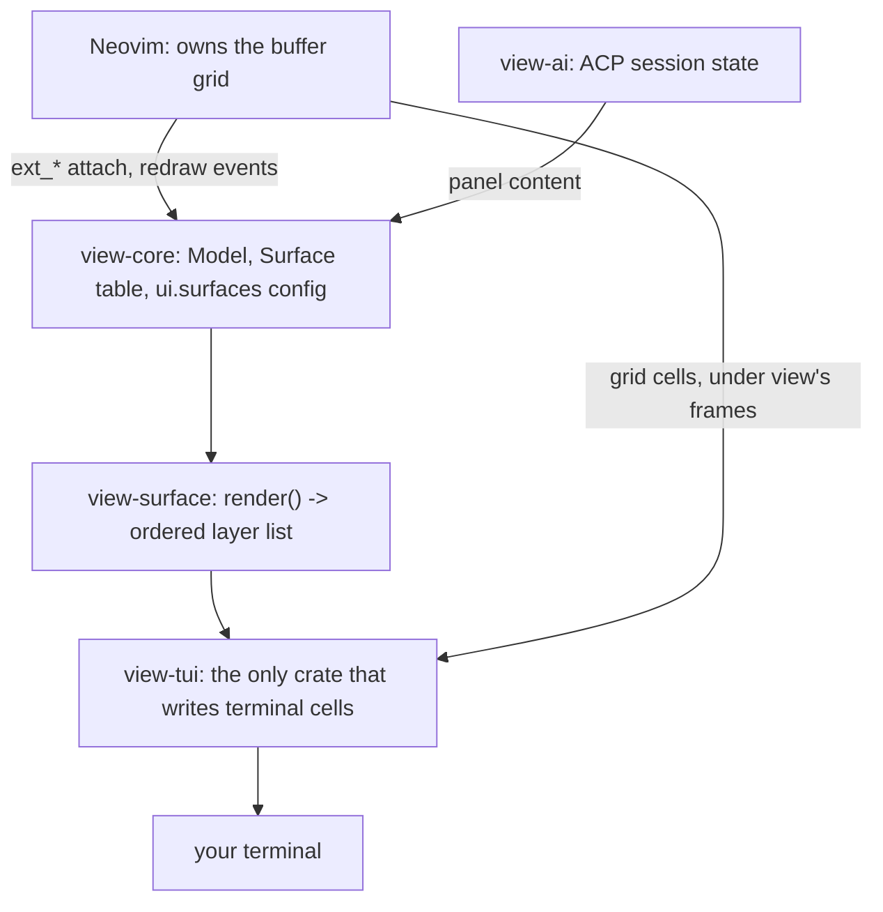

# The tiled UI

## What you see

Under `panes = "tiles"` every nvim window gets a frame of its own. The
window you are working in carries the accent colour on its frame. Every
other frame takes the colour your colorscheme gives the lines between
windows (`WinSeparator`). With `gaps = true` there is a clear cell between
two frames and around the outside of the screen. With `gaps = false` two
neighbouring tiles share one frame line, and the places where lines meet
take a junction glyph.

Under `panes = "nvim"` the screen keeps the shape nvim draws: the `│`
separator column between windows, restyled through `WinSeparator`.

Under `panes = "nvim"` view's own status bar keeps the bottom row. Under
tiles there is no bar row at all: each tile says its own status in its
frame.

## What a tile's frame says

| where | what it carries |
|---|---|
| gapped, top edge | the buffer name, with `[+]` on unsaved changes |
| gapped, bottom edge | the segments below |
| gapless, bottom edge | the buffer name, then the segments below |

| segment | shown on |
|---|---|
| the mode, `-- INSERT --` or `recording @q` | the tile you are working in |
| the git branch | every tile |
| the diagnostic counts, `E 2` and `W 1` | every tile whose buffer has any |
| the cursor position, `row:col` | every tile, from that window's own cursor |
| the keys you have typed so far | the tile you are working in |

A segment that runs out of room in the edge is dropped whole, with
everything after it.

`[native] statusline = false` empties the segments and leaves the frames
standing. It gives `laststatus` back to your config only under
`panes = "nvim"`. Under tiles view keeps `laststatus = 2`.

## The top row

The top row names what you have open. Under tiles it is there from the
moment the session starts. Under `panes = "nvim"` it follows your
`showtabline`: `0` keeps the row off, `1` brings it up once a second
tabpage is open, `2` keeps it up always. It is the same row in both modes.
`:View ui panes` moves the row with the mode it switches to, and says which
of the two now draws it.

| where | what it carries |
|---|---|
| left edge | the host `--remote` named, on a remote session |
| middle | your tabpages, the current one lit |
| right edge | what the agent is doing |

Clicking a name switches to it, in either mode.

```toml
[native]
# tabline = true          # follows [ui] panes: on under tiles, off under "nvim"
tabline_shows = "tabs"    # "tabs" | "buffers"
```

With `tabline_shows = "buffers"` the middle names your open files instead,
each with a `+` while it has unsaved changes. A second tabpage is named as
tabpages either way.

The agent's word is one of four:

| what is happening | word |
|---|---|
| the agent is asking your permission | `waiting` |
| a session is running | `running` |
| the agent died | `crashed` |
| anything else | `idle` |

`[native] tabline = false` leaves the row to nvim, so your own tabline
plugin keeps it.

## Choosing a mode

```toml
[ui]
panes = "auto"   # "auto" | "tiles" | "nvim"
gaps  = true     # false: frames share edges, no outer gap

[ui.tokens]
accent = "#89b4fa"   # the active tile's frame colour
```

`"auto"` asks the environment who is already drawing frames. A tiling
window manager puts a border around the terminal itself, and `"auto"`
answers `nvim` there.

| environment marker | answer |
|---|---|
| `HYPRLAND_INSTANCE_SIGNATURE` set | `nvim` |
| `SWAYSOCK` set | `nvim` |
| `I3SOCK` set | `nvim` |
| `XDG_CURRENT_DESKTOP` names `Hyprland`, `sway`, `i3`, `river`, `niri`, `bspwm`, `dwm`, `awesome`, `qtile`, `xmonad`, `herbstluftwm` or `leftwm` | `nvim` |
| anything else | `tiles` |

The comparison against `XDG_CURRENT_DESKTOP` ignores case and reads every
colon-separated member. An ssh session gets `tiles`.

`[engine] single_grid = true` resolves `panes` to `nvim` whatever the file
or the flag says. Without `ext_multigrid` nvim sends no `win_pos` and no
per-window grid.

The mode follows the same precedence as every other `[ui]` key: the
`--panes` flag, then `VIEW_UI_PANES`, then the file, then the environment.
`:View ui panes` in a running session prints the answer and the marker that
decided it:

```
ui.panes = nvim (HYPRLAND_INSTANCE_SIGNATURE)
```

`[keys] profile` is a choice of its own, alongside `[ui] panes`: it picks
whether a session answers the omarchy desktop's own chords. `<D-Left>`
reaches the same `<C-w>h` under either look mode. See
[keymaps.md](keymaps.md#key-profiles).

## Flipping the mode in a running session

```
:View ui panes tiles
:View ui panes nvim
:View ui panes auto
:View ui panes          " reports the mode and its marker
```

A flip re-attaches the outer grid at its new size, sends every window grid
a fresh inner size, and repaints the whole screen.

## How a frame gets its room

nvim owns the window layout. Under `ext_multigrid` it reports each window's
slot as `win_pos grid win startrow startcol width height` and paints the
window's text into a grid of its own.

`nvim_ui_try_resize_grid(grid, w, h)` sets that window's *inner* size. The
slot stays where nvim put it, the text grid becomes smaller than the slot,
and the difference belongs to view. Tiles mode asks each window for a grid
four columns and four rows smaller than its slot and draws the frame and the
gap into what is left. `<C-w>` commands, `:split`, and a plugin that opens
windows all keep working.

Three properties of that request shape the geometry:

- The request stands until it is replaced. After a `:vsplit` halves a slot
  the window keeps the old request. view sends a fresh one on every
  `win_pos` whose slot size changed.
- A request of `0, 0` returns a window to its slot's own size. That is what
  a gapless tile sends, and what every window gets on a flip to `nvim`.
- A `winbar` adds its row on top of the requested height. The row arrives as
  `win_viewport_margins`, and the height request carries it as a term.

A slot narrower than 5 columns or shorter than 5 rows has no room to spare,
so view leaves its grid at the slot size and draws the tile bare.

Gapless tiles need no room at all. The one cell between two windows is the
cell nvim already paints its separator column and status row into, and view
restyles those cells as the frame. The screen's top row and left column come
from the outer grid attaching one row and one column short.

Where view draws the command line it holds `cmdheight` at 0, so the lowest
window's status row is the outer grid's last row and the lowest tile's frame
reaches it. A session that gave back the palette or the notifications leaves
nvim a command-line row at the foot of the grid, and the frames stop above
it.

## The accent

The active tile's frame takes the first of these that resolves:

1. `[ui.tokens] accent` from your config
2. the `Function` highlight group's foreground
3. the `Statement` highlight group's foreground
4. view's own emphasis colour

The two highlight groups are read from the engine when a colorscheme
loads.

## Placing a surface

The file tree, the agent panel, the palette and the notification stream
each have their own `[ui.surfaces.<id>]` table, with a `placement`, an
`anchor` and a `size`. `placement` `"overlay"` floats the surface over
your buffer. `"windowed"` gives it a window of its own in nvim's layout,
so your buffers make room for it and every window command reaches it. The
palette is the one surface that takes its own band without a window
number: it covers the rows at its anchored edge while `:` is open, and
your buffers stay exactly where they were under it. A window command
lands on the buffer you were already in, and `:` opens the band the same
way it opens the centred palette. `anchor` is the edge, or for the notification
stream's toast stack the corner, it opens at, and its own accepted words
and default change with `placement`: a centred float has no centred
window to become, and a corner toast stack has no corner tile. `size` is
its share of the terminal; whether the same number reaches both placements
or windowed alone depends on the surface, named below.

```toml
[ui.surfaces.tree]
placement = "overlay"      # default: "overlay". "windowed" opens it as a
                            # window of its own
anchor = "left"             # default: "left", both placements. left | right
size = 30                   # percent of the terminal width. Default: 30

[ui.surfaces.agent]
placement = "overlay"
anchor = "right"             # default: "right", both placements. left | right
size = 30

[ui.surfaces.palette]
placement = "overlay"
anchor = "center"            # default: "center" overlay, "bottom" windowed.
                              # overlay: center | top | bottom
                              # windowed: top | bottom
size = 40                    # percent of the terminal height, both
                              # placements. Default: 40

[ui.surfaces.notifications]
placement = "overlay"
anchor = "top-right"         # default: "top-right" overlay, "right" windowed.
                              # overlay: top-left | top-right | bottom-left |
                              # bottom-right
                              # windowed: left | right | top | bottom
size = 30                    # percent of the terminal width (left/right) or
                              # height (top/bottom). Windowed only: the
                              # overlay history opens at a fixed size
```

`[native] tree_width` is `[ui.surfaces.tree] size` under its older name,
and `[ai] panel_width` is `[ui.surfaces.agent] size` under its. Write
either one; the newer key wins when a config writes both.

The notification stream's `anchor` is the toast stack's own corner: the
near box sits flush against it and every later box sits farther away. A
dismissed box leaves by sliding toward that corner, or by shrinking where
a left corner leaves it no column to slide into.

Windowed, the notification stream takes two shapes from the same edge its
`anchor` names. Left or right opens a tall, narrow list: every notice you
have seen, newest at the top. Top or bottom opens a short, wide ticker
instead, `winfixheight`-pinned so a split beside it cannot steal its rows.
Either shape shortens each entry's timestamp to `HH:MM:SS` once its own
tile is too narrow for the full date to fit beside the message.

## The placement ring

`<leader>uw` (`cycle_surfaces`) steps the tree, the agent panel, the
palette and the notification stream together through one shared,
three-position ring:

```
config -> windowed -> overlay -> config
```

`config` is what `view.toml` gave each surface at startup: `overlay` for
every surface but the ones you placed windowed yourself. The ring's
`windowed` and `overlay` stops move every surface to that placement at
once, whatever `view.toml` said. A third press returns every surface to
its own configured placement, the loop's only three stops. A surface
already open when the ring steps keeps what it was showing: the tree
keeps its cursor row, the agent panel keeps its transcript, and the
notification stream keeps what it was displaying. See
[keymaps.md](keymaps.md#gaps-and-the-placement-ring) for the key itself
and `<leader>ug`, the gaps toggle beside it.

## Width a surface has to work with

The tree, the agent panel and the other surfaces size themselves as a
percentage of the outer grid. Under gapped tiles the outer grid is already
two columns narrower than the terminal, and a tile spends four more on its
frame and gaps. A windowed surface has up to six columns less text width
than the same percentage of the terminal.

Inside its own pane, a windowed surface draws unframed: the tile around it
is already a box, so a border of the surface's own would be a second one
where a person sees one. Its content spans the full width nvim gave the
tile. A floating surface draws its own border and, at six columns wide or
more, a one-cell pad inside it on both sides. Its windowed counterpart keeps
those four columns for content.

## Screen regions, by crate

For each region on screen, which crate decides what goes there and which
crate paints it. `view-core` holds the `Model` and the surface tables that
decide content; `view-surface::render` turns that `Model` into an ordered
layer list; `view-tui` is the only crate that turns a layer into terminal
cells. See `docs/surface-ownership.md` for the fuller policy table (what a
plugin drawing over a region gets told, and the `view.toml` line that hands
each one back).



| region | decided by | painted by |
| --- | --- | --- |
| the buffer grid | Neovim | `view-tui` composites nvim's own cells in, unchanged |
| view frames (tile borders) | `view-core`'s `Surface::Frame` | `view-tui::paint::panes` |
| the pill (top row) | `view-core`'s `Surface::Tabline` | `view-tui::paint::pill` |
| toasts | `view-core`'s `Surface::Messages` | `view-tui::paint::toast` |
| the palette | `view-core`'s `Surface::Cmdline`, `Surface::Popupmenu` | `view-tui::paint` |
| the file tree | `view-core`'s `[ui.surfaces.tree]`, `native::tree` | `view-tui::paint` |
| the agent panel | `view-ai`'s ACP session, held in `view-core`'s `AiPanelView` | `view-tui::paint` |

The buffer grid is the one region nvim keeps for itself: view frames it and
draws every other region around it, but the cells inside stay nvim's.
